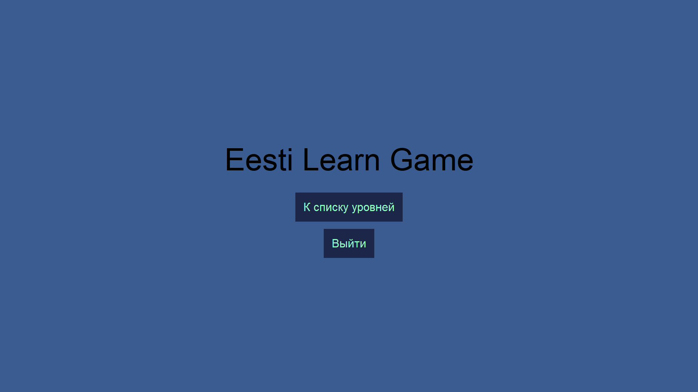
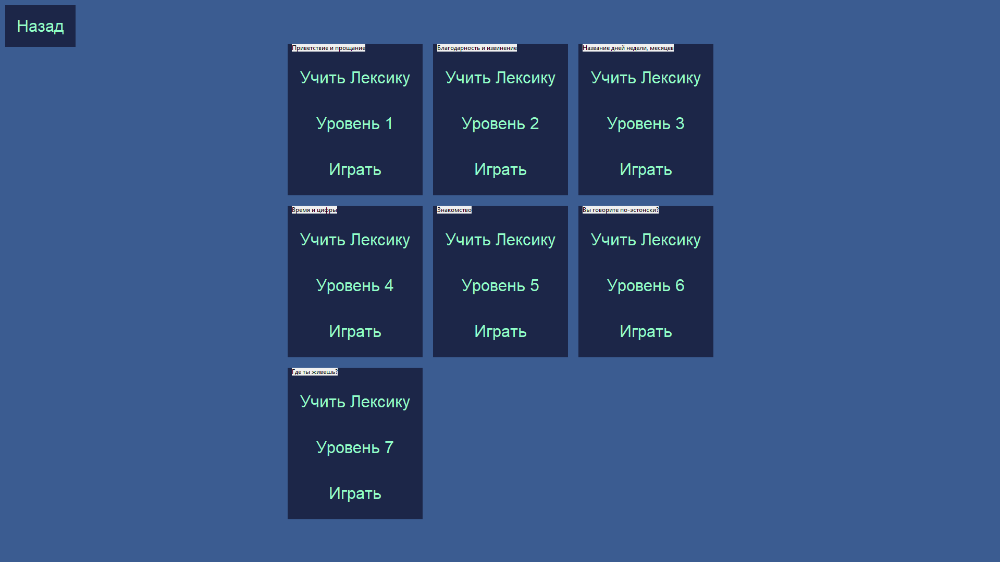
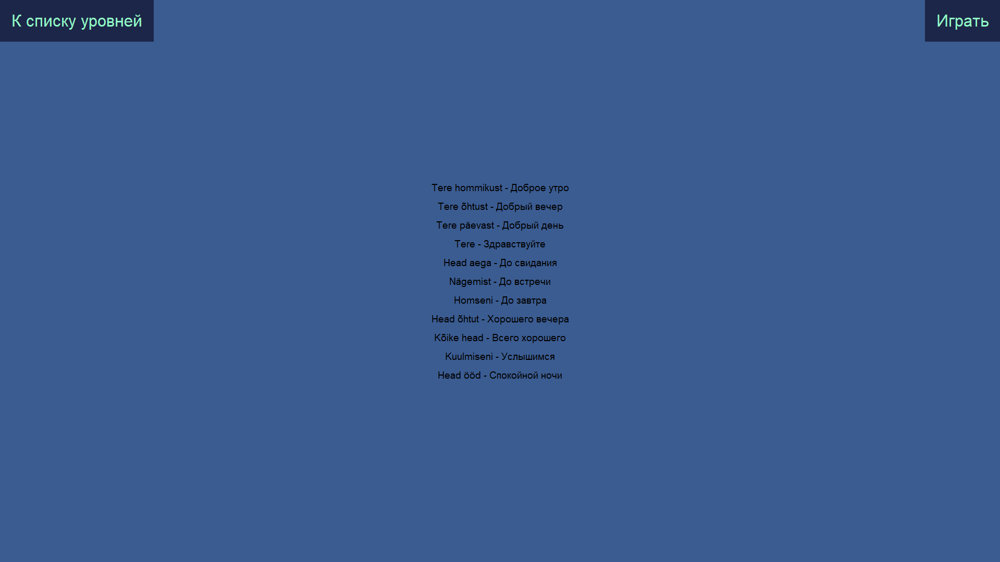
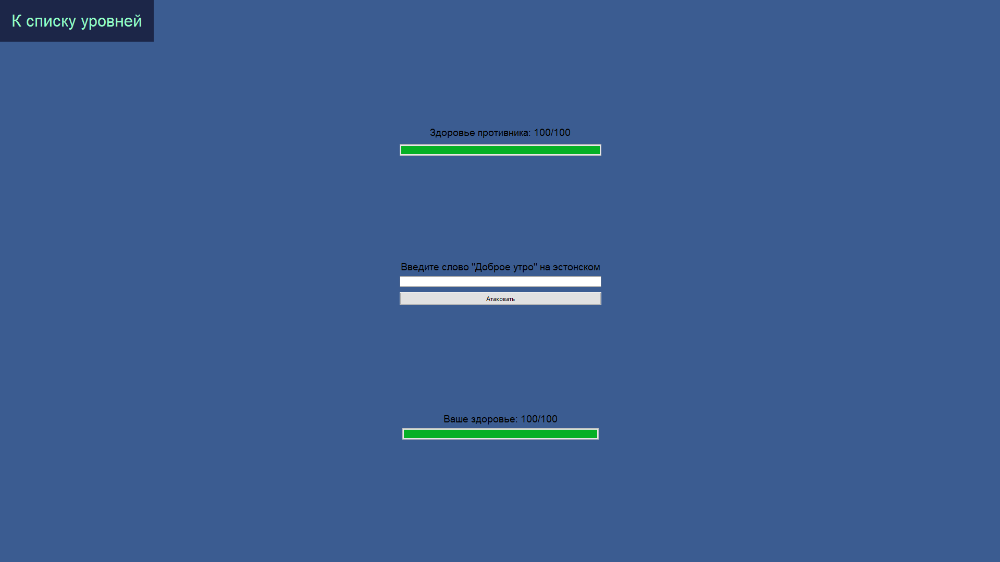
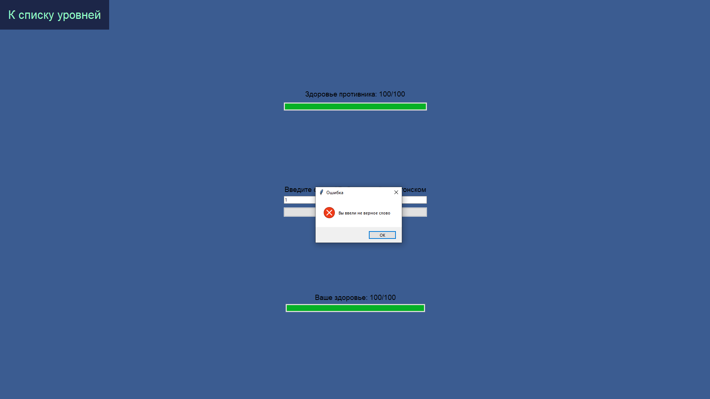
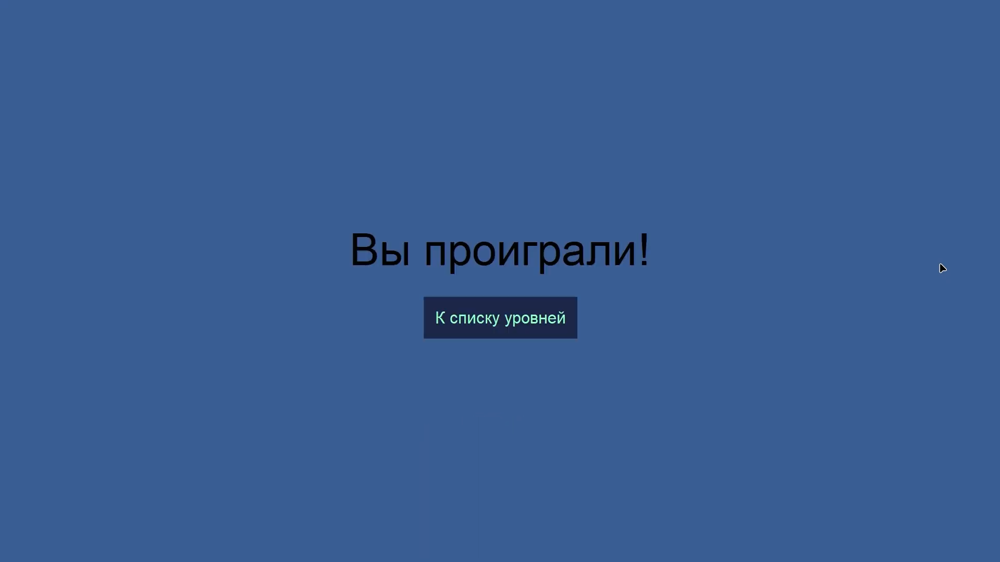

# python-eestiLearnGame
**Проект**: Игра для изучения слов на эстонском языке  
**Участники**: Арутр Паничев, Александр Деев, Денис Дунаев  
**Язык программирования**: Python  
**Библиотеки**: tkinter, random  
**Описание**: Игра, для изучение слов эстонского языка, на главной странице есть кнопка выхода и кнопка перехода у списку уровней. У каждого уровня есть 2 кнопку, первая для изучения лексики, а вторая для начала игры. На странице игры вверху экрана отображается полоса здоровья противника. Внизу отоброжается полоса здоровья игрока. Чтобы победить, нужно атаковать противника. Для атаки нужно вписать в поле для ввода в центре экрана слово на эстонском языке, которая отображается над ним на русском языке (Слова выбираются в случайном порядке, для каждого уровня определены свои слова). Здоровье игрока постоянно отнимается, с каким то промежутком времени.  

# Участики и их задачи

**Александр Деев**: Создание списка слов для игровых уровней.  
**Денис Дунаев**: Создание игрового интерфейса.  
**Артур Паничев**: Создание логики игровых уровней и пользовательских интерфейсов.  

## Прототип:
       
