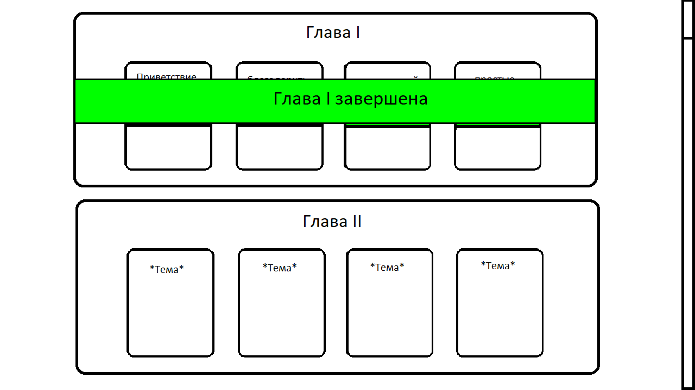

# python-eestiLearnGame
**Проект**: Сайт - Игра для изучения слов на эстонском языке  
**Участники**: Арутр Паничев, Александр Деев, Денис Дунаев  
**Язык программирования**: Python  
**Библиотеки**: Streamlit, random  
**Описание**: Сайт игра, для изучение слов эстонского языка, на главной странице сайта есть список глав, в каждой главе есть карточка уровня. Уровни нужно завершать по очередно. Нельзя начинать следующий уровень или главу, не завершаяя предыдущую. При выборе уровня начинается бой с противником. Вверху экрана отображается полоса здоровья противника. Внизу отоброжается полоса здоровья игрока. Чтобы победить, нужно атаковать противника. Для атаки нужно вписать в поле для ввода в центре экрана слово на эстонском языке, которая отображается над ним на русском языке (Слова выбираются в случайном порядке, для каждого уровня определены свои слова). Здоровье игрока постоянно отнимается, с каким то промежутком времени, который зависит от выбранного уровня.  

## Прототип:
  
.
